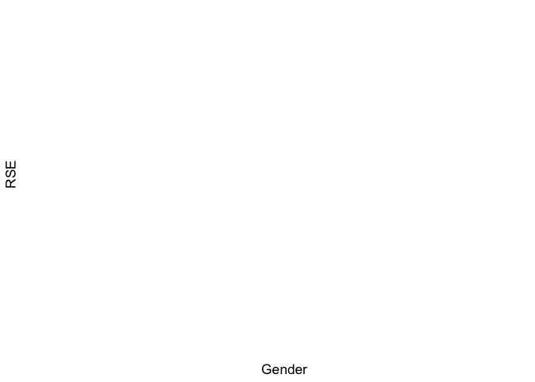
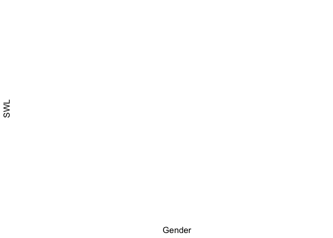

Lab3
================
Your Name
2024-09-19

# Load Packages

``` r
library(haven)
library(dplyr)
```

    ## Warning: package 'dplyr' was built under R version 4.2.3

    ## 
    ## Attaching package: 'dplyr'

    ## The following objects are masked from 'package:stats':
    ## 
    ##     filter, lag

    ## The following objects are masked from 'package:base':
    ## 
    ##     intersect, setdiff, setequal, union

``` r
library(tidyr)
```

    ## Warning: package 'tidyr' was built under R version 4.2.3

``` r
library(ggplot2)
```

    ## Warning: package 'ggplot2' was built under R version 4.2.3

``` r
library(psych)
```

    ## 
    ## Attaching package: 'psych'

    ## The following objects are masked from 'package:ggplot2':
    ## 
    ##     %+%, alpha

``` r
library(ggsci)
library(see)
```

    ## 
    ## Attaching package: 'see'

    ## The following objects are masked from 'package:ggsci':
    ## 
    ##     scale_color_material, scale_colour_material, scale_fill_material

# Load Datasets

``` r
lab3data <- read.csv("/Users/jostarenky/Documents/GitHub/Lab3/lab3data.csv")
```

# Missing Data

``` r
#Listwise deletion
list_lab3data<- drop_na(lab3data)

#pair wise deletion will only be used when you run the actual analysis using "na.rm = TRUE"
```

# Recode Variables: Changing Numeric Values to Characters

``` r
lab3data %>% count(Gender)
```

    ##   Gender   n
    ## 1      1 154
    ## 2      2 145
    ## 3     NA   1

``` r
#Solution 1 - the mutate command doesn't work for me, I think because my RStudio can't install the "bruce" package
#lab3data<- lab3data%>%
 # mutate_at(c('Gender'),funs(str_replace(., "1", "Male")))

#Solution 2

lab3data$Gender<-recode(lab3data$Gender, 'X' = 'Female', 'Y' = 'Male')
```

    ## Warning in recode.numeric(lab3data$Gender, X = "Female", Y = "Male"): NAs
    ## introduced by coercion

    ## Warning: Unreplaced values treated as NA as `.x` is not compatible.
    ## Please specify replacements exhaustively or supply `.default`.

``` r
lab3data %>% count(Gender)
```

    ##   Gender   n
    ## 1   <NA> 300

``` r
#Now recode 2 into Female
```

# Recode Variables: Changing Numeric Values to Different Numeric Values

``` r
lab3data %>% count(RSE2)
```

    ##   RSE2   n
    ## 1    1 124
    ## 2    2  86
    ## 3    3  53
    ## 4    4  37

``` r
lab3data$RSE2_R <- 5 - lab3data$RSE2

#check to see if the recoding was successful
lab3data %>% count(RSE2_R)
```

    ##   RSE2_R   n
    ## 1      1  37
    ## 2      2  53
    ## 3      3  86
    ## 4      4 124

``` r
#Now do the same for the other items (5,6,8,9)
lab3data %>% count(RSE5)
```

    ##   RSE5   n
    ## 1    1 117
    ## 2    2 108
    ## 3    3  49
    ## 4    4  26

``` r
lab3data$RSE5_R <-5  - lab3data$RSE5
lab3data %>% count(RSE5_R)
```

    ##   RSE5_R   n
    ## 1      1  26
    ## 2      2  49
    ## 3      3 108
    ## 4      4 117

``` r
lab3data %>% count(RSE6)
```

    ##   RSE6   n
    ## 1    1 112
    ## 2    2  86
    ## 3    3  66
    ## 4    4  36

``` r
lab3data$RSE6_R <-5  - lab3data$RSE6
lab3data %>% count(RSE6_R)
```

    ##   RSE6_R   n
    ## 1      1  36
    ## 2      2  66
    ## 3      3  86
    ## 4      4 112

``` r
lab3data %>% count(RSE8)
```

    ##   RSE8  n
    ## 1    1 76
    ## 2    2 94
    ## 3    3 82
    ## 4    4 48

``` r
lab3data$RSE8_R <-5  - lab3data$RSE8
lab3data %>% count(RSE8_R)
```

    ##   RSE8_R  n
    ## 1      1 48
    ## 2      2 82
    ## 3      3 94
    ## 4      4 76

``` r
lab3data %>% count(RSE9)
```

    ##   RSE9   n
    ## 1    1 143
    ## 2    2  90
    ## 3    3  38
    ## 4    4  29

``` r
lab3data$RSE9_R <-5  - lab3data$RSE9
lab3data %>% count(RSE9_R)
```

    ##   RSE9_R   n
    ## 1      1  29
    ## 2      2  38
    ## 3      3  90
    ## 4      4 143

# Create Composites

``` r
#Depending on the scale, sometimes you need to average across the items, other times you might need to sum 


#Fill in the items
lab3data <- lab3data %>%
  mutate(RSE = rowMeans(cbind(RSE1, RSE2_R, RSE3, RSE4, RSE5_R, RSE6_R, RSE7, RSE8_R, RSE9_R, RSE10)))

#Create another composite for SWL, but this time use rowSums
lab3data <- lab3data %>%
  mutate(SWL = rowSums(cbind(SWL1, SWL2, SWL3, SWL4, SWL5)))
```

# Get Summary Descriptive Statistics

``` r
lab3data %>% 
group_by(Gender) %>%
  dplyr::summarize(mean_SWL    = mean(SWL),
      mean_RSE    = mean(RSE),
      std_dev_SWL = sd(SWL),
      std_dev_RSE = sd(RSE),
      corr_SWL_RSE  = cor(SWL, RSE)
)
```

    ## # A tibble: 1 × 6
    ##   Gender mean_SWL mean_RSE std_dev_SWL std_dev_RSE corr_SWL_RSE
    ##   <chr>     <dbl>    <dbl>       <dbl>       <dbl>        <dbl>
    ## 1 <NA>       16.3     3.05        5.22       0.665        0.431

# Q1: Descrptively, which group has a higher self-esteem? What about life satisfaction? Is the relationship between self-esteem and life satisfaction stronger for males or for females?

Women have higher self-esteem scores than men, and men have higher life
satisfaction scores than women The relationship between the two is also
stronger in women, as evidenced by the higher correlation.

# Visualization of Data Distribution

``` r
lab3data<- lab3data %>%
  drop_na(Gender)


ggplot(lab3data, aes(x = Gender, y = RSE)) + geom_violin(aes(fill=Gender)) + scale_fill_simpsons() + theme_modern()
```

<!-- -->

``` r
#Create a plot for SWL by Gender with a different color palette

lab3data<- lab3data %>%
  drop_na(Gender)


ggplot(lab3data, aes(x = Gender, y = SWL)) + geom_violin(aes(fill=Gender)) + scale_fill_cosmic() + theme_modern()
```

<!-- -->

# Q2: What you can tell from looking at a violin plot? What you cannot tell? What inferences you can make based on the two violin plots?

You can see the distribution of scores and get a good sense of the mode,
but you can’t necessarily see the mean - for example, based on the
violin plot for SWL, the majority of the scores were around 20, whereas
the means were around 16. We also cannot see the correlations or SDs. We
can infer that more women score highly for RSE than men, and slightly
more men score highly for SWL than women.
